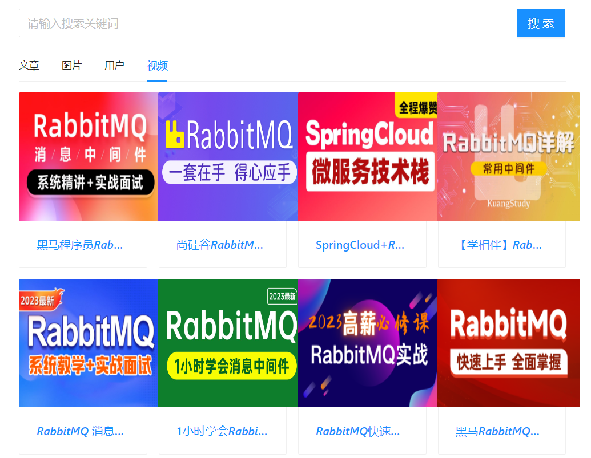
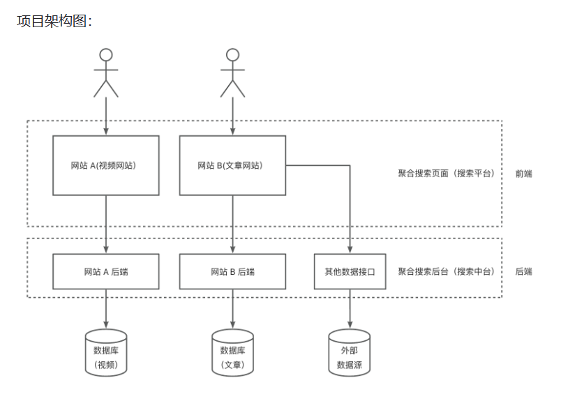

### 项目简介 ###

- - -
isouhub是基于Spring Boot + Elastic Stack 的一站式聚合搜索平台，对用户来说，使用该
平台，可以在同一个页面集中搜索出不同来源、不同类型的内容，提升用户的检索效率和搜索体验。

### 项目展示 ###

- - -
搜文章：

高亮效果：

搜图片：

PS:
项目图片服务使用了微软提供的第三方图片服务接口————>>  [点击链接](https://www.bing.com/?scope=images&nr=1&FORM=NOFORM)

搜用户：

搜视频：

PS:
项目视频服务来源于某站，接口调用可参考： [bilibili-API-collect](https://github.com/SocialSisterYi/bilibili-API-collect)

### 项目架构图 ### 

- - -

### 技术选型（后端部分） ###

- - -

+ Spring Boot 2.7 框架
+ MySQL 数据库
+ Elastic Stack
    - Elasticsearch 搜索引擎
    - Kibana 数据可视化

- 数据抓取（jsoup、HttpClient 爬虫）
    - 离线
    - 实时
- 设计模式
    - 门面模式
    - 适配器模式
    - 注册器模式
- 数据同步
    - 定时
    - 双写
    - Logstash
    - Canal
- JMeter压力测试

